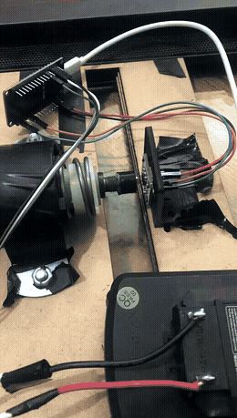
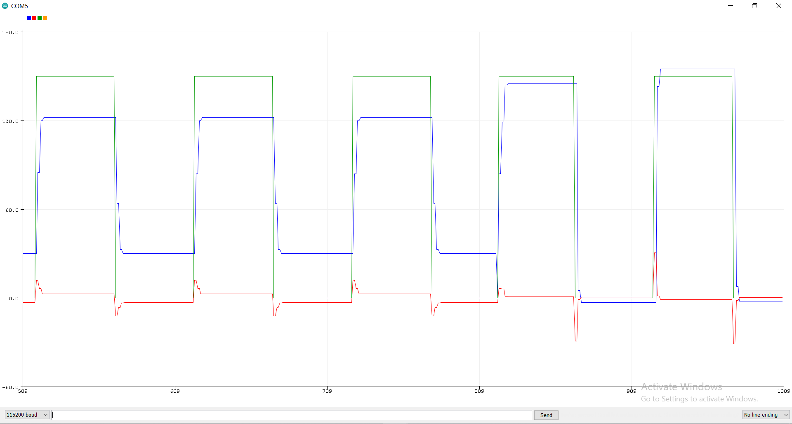

# DC Motor PID Tuning Bench

**Closed-loop position control of a DC motor, closed by a magnetic rotary encoder — the bench work that came before [active-ankle-prosthesis](https://github.com/Tawakoll/active-ankle-prosthesis).**



The motor tracking the PID position loop on the bench. The original screen capture is at [`media/demo/dc-motor-pid-enhanced.mp4`](media/demo/dc-motor-pid-enhanced.mp4) (full quality; GitHub will not play it inline from a repository path, so it downloads rather than streams, which is why the GIF is here instead) — the unprocessed capture is [`dc-motor-pid-original.mp4`](media/demo/dc-motor-pid-original.mp4).


**1** RS-550S motor · **2** ball screw and coupling · **3** Cytron MD10C driver · **4** ATmega328 board · **5** 18 V drill battery

> **Archived academic project, 2021.** This bench was built as the first stage of our B.Sc. graduation project (active ankle prosthesis) in Mechatronics Engineering at AASTMT, Cairo. It is kept here as a record of the work. Nobody maintains it.

---

## The DC motor PID tuning came first

None of the control work waited for the mechanical build of the ankle. While the ankle was still being machined, we put a bench together with just the motor, the H-bridge and the encoder, and developed against that.

[`firmware/motor-test-bench/`](firmware/motor-test-bench) is that work, and the sketches read as the sequence we actually went through.

<details>
<summary><b>The bring-up sequence, sketch by sketch</b></summary>

| Stage | Sketches |
|---|---|
| Encoder alone, magnet detection and angle read | `encoder_angle` |
| Encoder driving the motor through the H-bridge | `read_angle_with_motor` |
| Current sensing, standalone then under load | `CURRENT_SENSOR`, `CURRENT_SENSOR_motor` |
| Load cell characterisation | `Read_1x_load_cell_renewed` |
| Moving to an RTOS, one concern per task | `FreeRTOS_sketch`, `testing_encoder_with_rtos`, `target_angle_and_printing` |
| PID under the scheduler | `rtos_with_pid`, `rtos_with_pid_library` |
| Position control, then position plus current | `pid_position_control_code`, `pid_position_control_current_code` |
| Full bench controller with the gait trajectory | `FINAL_PID_CODE_WITH_RTOS` |

Note: `FINAL_PID_CODE_WITH_RTOS` has "FINAL" in its name but includes `Arduino_FreeRTOS.h` and calls `analogWrite()`, both AVR-only. The name is misleading: it is the final *bench* controller, the last milestone before the ESP32 build used on the assembled ankle — not the final firmware for that project.

</details>

By the time the assembled ankle existed, the loop was already tuned and the gains were known. The move to the ESP32 and the load cell array happened afterward, in the active-ankle-prosthesis repo, on a controller we already trusted.

## Tuning it

We tuned by hand over the serial link. The setpoint was a square wave between 0 and 150 counts, and we changed one gain at a time and watched the response. Green is the setpoint, blue the measured position, red the PID output.


<details>
<summary><b>The rest of the sweep</b></summary>

**Kp = 0.1.** The response settles below the setpoint and never closes the gap:


**Kp = 0.1 against 0.2:**



Raising Kp closes the steady-state gap and brings overshoot with it. The integral term, settling at Ki = 0.2, is what removed the remaining offset.

</details>

<details>
<summary><b>Current sensing on the bench</b></summary>

ACS712 output during bring-up, reading roughly 73.94 mA at rest against a 2503 mV reference, with a step to 147.88 mA under load:


This was used to characterise the motor and choose the duty ceiling. It did not make it into the final ESP32 build used on the active ankle.

</details>

## Demo footage

Raw screen captures of the bench PID response, in [`media/demo/`](media/demo): `dc-motor-pid-original.mp4` and `dc-motor-pid-enhanced.mp4`.

---

## What is in this repository

```
firmware/
  motor-test-bench/   AVR bench sketches: motor, H-bridge, encoder, PID tuning
media/
  hardware/  results/  demo/
```

---

## Licence

The code under `firmware/` is MIT. The media under `media/` is CC BY-NC 4.0.
